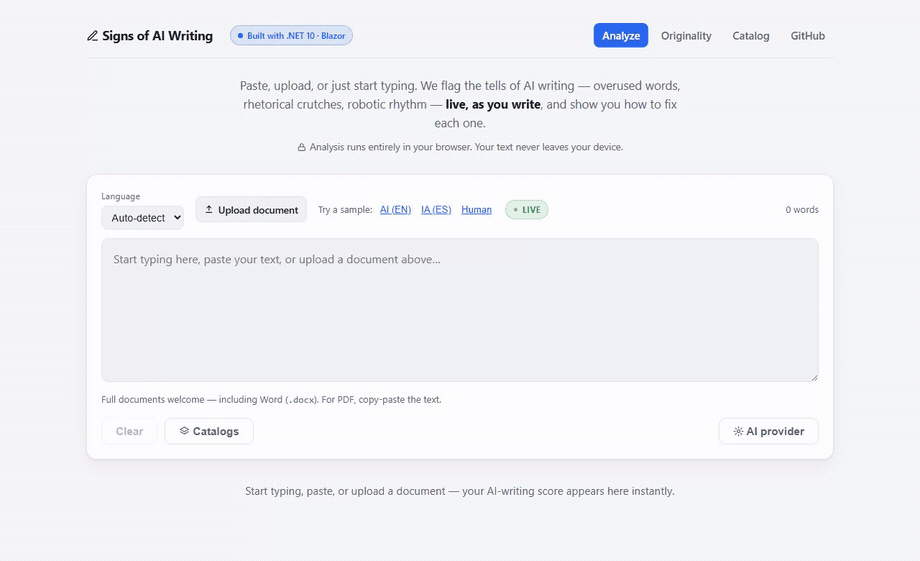
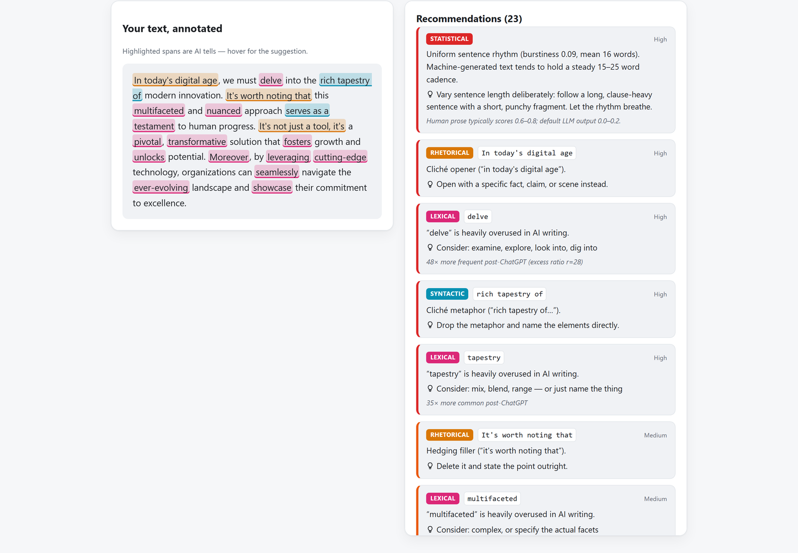
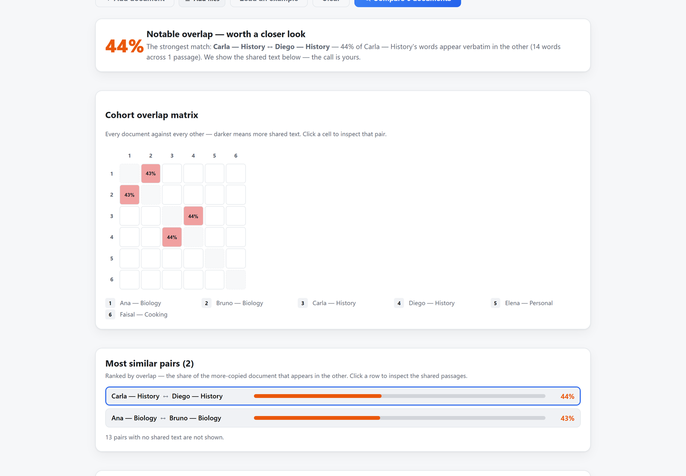

# ✍︎ Signs of AI Writing

[](https://peopleworks.github.io/SignsofAI/)
[](https://github.com/peopleworks/SignsofAI/releases/tag/desktop-v0.1.0)
[](LICENSE)
[](https://dotnet.microsoft.com/)
[](https://learn.microsoft.com/aspnet/core/blazor/)
[](https://github.com/peopleworks/SignsofAI/stargazers)

[](https://www.nuget.org/packages/SignsOfAI.Core)
[](https://www.nuget.org/packages/SignsOfAI.Cli)
[](https://www.nuget.org/packages/SignsOfAI.Mcp)
[](https://codeguilds.dev/packages/signsofai)

**[Try the live demo &rarr;](https://peopleworks.github.io/SignsofAI/)** — English & Spanish, runs 100% in your browser. No signup, and nothing leaves your device.

**[Download the Windows app &rarr;](https://github.com/peopleworks/SignsofAI/releases/tag/desktop-v0.1.0)** — the same tool in a window. Nothing to install alongside it: the .NET runtime is bundled.



<sub>Real recording of the live demo — the score updates as you type, and every highlight comes with a suggested fix.</sub>

**Rather watch than read?** The two-minute explainer:
[**English**](https://youtu.be/pKkMRAku7ZQ) · [**Español**](https://youtu.be/7Rp3dlX_iig)

A free, privacy-first toolkit for **academic and writing integrity**. It does two things:

1. **De-AI-ify linter** — flags the tells of AI-generated writing (overused vocabulary, rhetorical
   crutches, robotic sentence rhythm) and, for **every** finding, tells you *how to fix it*.
2. **Originality checker** — *"did they write it, or copy it?"* Compares documents against each other
   and surfaces the passages they share — verbatim copies, **reworded paraphrases** (even across
   languages), and a whole-cohort overview — as **evidence a human judges**. Not a black-box verdict.

> 🔒 **Almost everything runs 100% in your browser. Your documents never leave your device.**
> The only exception is the optional paraphrase check, which is strictly opt-in and clearly disclosed.

Built with **.NET 10** and **Blazor WebAssembly** by **Pedro Hernández (PeopleWorks)**, [Microsoft MVP for .NET](https://mvp.microsoft.com/en-US/mvp/profile/24060a02-dbc6-44ec-bca5-c213ff9835c5) — for the .NET and Microsoft developer community, *por y para la comunidad educativa*.

Repo: https://github.com/peopleworks/SignsofAI

English and Spanish are supported in two **independent** ways:

- **The interface** switches EN ⇄ ES instantly from the toolbar — no page reload, remembered per
  browser, and it follows your browser's language on a first visit. Translations are plain JSON files
  anyone can contribute: see [*Translating the interface*](#translating-the-interface).
- **The analysis** runs against a per-language rule-pack, auto-detected or selectable. The Spanish
  rule-pack is an original derivation of AI-writing markers for Spanish.

The two are separate on purpose, so findings stay in the language of the *text being analyzed*: advice
about English prose is given in English even when the interface is in Spanish, because that's the
language the advice is about.

---

## 1. The AI-writing linter ("Analyze")

Unlike black-box detectors that only spit out a score, this is an **explainable, actionable, educational**
linter. Paste, upload (`.docx` / `.txt` / `.md`), or **just start typing** — the 0–100 score, highlights,
statistics, and per-finding fixes update **as you write**.

| Category       | Examples |
|----------------|----------|
| **Lexical**     | *delve, tapestry, multifaceted, nuanced, pivotal, underscore, showcase, testament…* (weighted by post-ChatGPT excess frequency) |
| **Rhetorical**  | Negative parallelisms (*"it's not just X, it's Y"*), cliché openers (*"in today's digital age"*), hedging (*"it's worth noting that"*), false ranges, rule-of-three |
| **Syntactic**   | Copula avoidance (*"serves as a…"*, *"a testament to…"*), inflated constructions (*"plays a crucial role"*) |
| **Statistical** | **Burstiness** — sentence-length uniformity. Machine text hovers at 0.0–0.2; human prose 0.6–0.8 |

- **Sentence-rhythm visualization** — a per-sentence bar chart that makes *burstiness* visible.
- **Per-finding recommendations** — every flagged tell carries a concrete fix and the research behind it.
- **Live rewrite (on-device, no key)** — your text and a de-AI-ified version side by side, rebuilt on
  every keystroke, with the score dropping as you go. It runs off the rule-pack — no model, no network,
  no API key — so it is instant and free. Every change is listed with alternatives to pick from and a
  one-click *leave this one alone*. Three strengths, from *only the strongest tells* to *delete the
  empty intensifiers too*.

  It only does what a word swap can honestly do, and **declines the edits it would get wrong**: it
  won't turn "delve into" into "examine into", won't drop the "just" that a *"not just X, it's Y"*
  construction depends on, and won't put "el" in front of a feminine noun. Rhythm and rhetorical
  structure need real rewriting, so those stay in the recommendations — and the panel says how many.
- **Humanize (optional, BYOK)** — connect an AI provider and rewrite the flagged text in one click.
  Anthropic (`claude-opus-4-8`, works from the browser), OpenAI / DeepSeek, Azure OpenAI, or **Ollama**
  (local, no key). Credentials live only in your browser and are sent **directly** to the provider.
- **Before/after diff** and a **shareable result card** (a PNG summary that never includes your text).
- **Custom catalogs (BYO rules)** — paste banned words or import a rule-pack JSON; merges live.
- **Catalog page** — a searchable library of every AI-writing sign, in both languages, ranked with an
  in-browser BM25 index.



<sub>This is the difference: not "87% AI", but *which* words, *why* they were flagged, and *what to write instead*.</sub>

## 2. The Originality checker ("Originality")

*"¿Lo escribió la IA, lo copiaste, o lo parafraseaste para esconderlo?"* Drop in two or more documents —
a thesis and its sources, a batch of student submissions — and see exactly what they share. The guiding
principle is honest: **we surface the evidence and highlight it; a human judges. We never accuse.** This is
**not** a whole-internet index like Turnitin.

| Phase | What it catches | How | Where it runs |
|-------|-----------------|-----|---------------|
| **A — Literal copy** | verbatim shared passages, resistant to changed capitalization/accents | accent/case-folded word *k*-shingles + greedy longest-match tiling, verified token-by-token | 🔒 **in your browser** |
| **B — Paraphrase** | *reworded* copies — same idea, different words — **even across languages** | sentence embeddings (Google **EmbeddingGemma-300M**, ONNX) + cosine similarity | 🌐 optional server (**opt-in**) |
| **C — Cohort** | who copied whom across a whole class, at a glance | batch upload + an N×N **overlap heatmap**; click a cell to inspect the pair | 🔒 **in your browser** |
| **D — Web spot-check** | whether a passage already exists online | extracts a document's most **distinctive passages** and hands you one-click exact-phrase searches (Google/Bing/DuckDuckGo) | 🔒 **in your browser** |

- **Shared-passage evidence** — matches are highlighted in both documents, side by side; the headline
  overlap number equals exactly what you see highlighted (the evidence *is* the score).
- **Phase B is the one feature that leaves the device.** It's opt-in, disclosed in the UI, and sends only
  the sentences you choose to check to the PeopleWorks server. Everything else stays on your machine.
- **Phase D** is deliberately honest: we can't index the whole web, so instead of pretending to, we surface
  the passages worth checking and prepare the searches — nothing is sent anywhere until *you* click one.
  An **optional automatic web search** can be enabled by the server operator (see *Optional server* below).



<sub>A whole class at a glance: every document against every other, then the shared passages themselves — evidence, not an accusation.</sub>

## 3. The predictability meter (optional server)

An honest reframing of perplexity. A small language model (Qwen2.5-0.5B or Microsoft Phi-4-mini, int8 ONNX)
measures how *predictable / generic* a text's phrasing is. **This is not an AI-vs-human verdict** — on a
labelled corpus the two overlap badly (memorized human text scores *predictable* too). We surface
predictability honestly as one signal among many, calibrated per language. Opt-in; runs on the PeopleWorks
server. The model lazily loads and idle-unloads to keep the server light.

## 4. Use it from other apps — MCP server

Everything above is also available to **Claude Desktop and any [MCP](https://modelcontextprotocol.io)
client** through `SignsOfAI.Mcp`, a Model Context Protocol server (built on the official
[`ModelContextProtocol`](https://www.nuget.org/packages/ModelContextProtocol) SDK, stdio transport). Because
the engine lives in `SignsOfAI.Core` — pure .NET, no browser — the server just exposes it as tools:

| Tool | What it does | Where it runs |
|------|--------------|---------------|
| `analyze_ai_writing` | score + verdict + findings (with fixes) + statistics | 🔒 on-device |
| `check_originality` | overlap % and shared passages across 2+ documents | 🔒 on-device |
| `search_catalog` | search the catalog of AI-writing signs (EN/ES) | 🔒 on-device |
| `extract_distinctive_phrases` | distinctive phrases + ready-made web-search links | 🔒 on-device |
| `inspect_characters` | invisible characters & letters impersonating Latin ones, with line/column | 🔒 on-device |
| `check_citations` | where a document contradicts its own bibliography, with the line of each | 🔒 on-device |
| `measure_predictability` | perplexity via the optional server | 🌐 server (**opt-in**) |
| `check_paraphrase` | reworded/translated matches via EmbeddingGemma | 🌐 server (**opt-in**) |

The first six run entirely on the machine; the last two disclose that they send text to the server
(endpoint via the `SIGNSOFAI_API_ENDPOINT` environment variable).

It ships on NuGet as [`SignsOfAI.Mcp`](https://www.nuget.org/packages/SignsOfAI.Mcp), so nothing needs
building. Point Claude Desktop at it:

```jsonc
// %APPDATA%\Claude\claude_desktop_config.json
{ "mcpServers": { "signs-of-ai": {
  "command": "dnx",
  "args": ["SignsOfAI.Mcp", "--yes"]
}}}
```

Or install it as a global tool once — `dotnet tool install --global SignsOfAI.Mcp` — and use
`"command": "signsofai-mcp"`. See `src/SignsOfAI.Mcp/README.md` for details.

**VS Code**: the package ships an MCP manifest, so its
[NuGet page](https://www.nuget.org/packages/SignsOfAI.Mcp) has an **MCP Server** tab with the config
already generated — copy it into `.vscode/mcp.json` and you're done.

## 5. Use it as an agent skill — `/signs-of-ai`

Prefer to work inside your editor? `skill/signs-of-ai` is a drop-in **Claude Code / Codex / agent skill**
that de-slops a draft — or judges whether text reads as AI-written — in **English and Spanish**. It's a
human-readable distillation of the same `rules.en.json` / `rules.es.json` taxonomy, so it edits by the
same rules the engine scores by. Install by pasting the repo link into your AI harness, or copy the
folder into `~/.claude/skills/`, then:

```
/signs-of-ai            <your draft>          # edit mode: rewrite + change summary
/signs-of-ai is this AI slop?  <the text>     # detect mode: quoted verdict, no rewrite
```

The skill deliberately **never fakes a numeric score** — for a calibrated 0–100 verdict, burstiness,
originality, or perplexity it hands off to this engine (web app, CLI, or the MCP tools above). See
`skill/README.md`.

---

## Architecture

```
SignsOfAI.slnx
├─ src/
│  ├─ SignsOfAI.Core            # Pure C# engines (no UI/server deps)
│  │  ├─ Analyzers/             # Lexical, Pattern, Burstiness (IAnalyzer)
│  │  ├─ Originality/           # OriginalityChecker (shingles+tiling), ParaphraseFinder,
│  │  │                         #   DistinctivePhraseExtractor
│  │  ├─ Rewriting/             # LocalRewriter — on-device de-AI-ifying, no model or network
│  │  ├─ Rules/Packs/           # rules.en.json, rules.es.json (embedded, community-extensible)
│  │  ├─ Text/                  # Tokenizer, sentence splitter, language detector, statistics
│  │  └─ AiWritingAnalyzer      # Public facade: Analyze(text, language)
│  ├─ SignsOfAI.UI              # The whole interface (Analyze, Originality, Catalog) — shared by
│  │  │                         #   both hosts below, so a change lands in web and desktop at once
│  │  └─ wwwroot/i18n/          # UI translations: en.json, es.json + locales.json (community-extensible)
│  ├─ SignsOfAI.Web             # Host: Blazor WebAssembly, runs in the browser
│  ├─ SignsOfAI.Desktop         # Host: WPF + WebView2, runs offline and reaches local models
│  ├─ SignsOfAI.Cli             # `dotnet tool` for CI pipelines
│  ├─ SignsOfAI.Mcp             # MCP server (stdio): the engine as tools for Claude Desktop / any client
│  └─ SignsOfAI.Perplexity.Api  # Optional ASP.NET Core server: predictability + embeddings
│     ├─ Engine/                #   OnnxPerplexityEngine, OnnxEmbeddingEngine (lazy-load + idle-unload)
│     └─ Config/                #   model profiles, calibration, embedding + web-search options
└─ tests/
   └─ SignsOfAI.Core.Tests      # xUnit (120+, incl. guards for the community locale files)
```

The Core engines are decoupled from the UI and server — the CLI, the Blazor app, and the API all reuse them.

## Run it

```bash
dotnet run --project src/SignsOfAI.Web
# then open http://localhost:5019
```

## Test

```bash
dotnet test
```

## Command line & CI (`dotnet tool`)

The linter ships as a global tool so you can gate prose in CI:

```bash
dotnet tool install --global SignsOfAI.Cli

signsofai check README.md                 # pretty report
signsofai check article.docx --lang en    # Word documents too
signsofai check post.md --json            # machine-readable
signsofai check post.md --max-score 40    # exit 1 if it reads too much like AI → fails CI
signsofai check post.md --rules my-style.json   # your custom catalog
```

The analysis engine is also a library — `dotnet add package SignsOfAI.Core`:

```csharp
var result = new SignsOfAI.Core.AiWritingAnalyzer().Analyze(text, "auto");
Console.WriteLine($"{result.OverallScore}/100 — {result.Verdict}");
```

## Optional server (`SignsOfAI.Perplexity.Api`)

The client works fully on its own; this server only powers the **opt-in** features (the predictability meter
and the Phase B paraphrase check). It's ASP.NET Core (.NET 10) hosting ONNX models with lazy-load and
idle-unload so it stays light. Model files are **not** in git — they download on first use.

The client points at a hosted instance by default; to run your own, set the endpoint in the app's server
settings and configure CORS for your origin.

### Enabling the optional automatic web search (Phase D)

By default Phase D is the on-device, one-click-search experience (no key, nothing sent until you click).
An operator can additionally enable an **automatic** web search — useful for presentations — by configuring
a search provider **on the server** (the key never touches the browser). It stays **off unless configured**:

```jsonc
// appsettings.json (or environment variables)
"WebSearch": {
  "Enabled": true,
  "Provider": "brave",              // Brave Search API (free tier); provider-abstracted
  "ApiKey": "",                     // prefer the BRAVE_API_KEY environment variable
  "MaxPhrasesPerDoc": 8,
  "MaxResultsPerPhrase": 5
}
```

When enabled, the server advertises the capability and the client offers an automatic "search the web"
action that reports pages containing a passage **verbatim**. If it's off, quota-exhausted, or errors, the UI
falls back to the manual one-click searches — it never breaks.

## Extending the rules

Add entries to `src/SignsOfAI.Core/Rules/Packs/rules.<lang>.json` — **lexical** rules match single word
tokens, **pattern** rules are regexes for multi-word tells. Each sets a `weight`, `severity`, and `suggestion`.

A lexical rule can also tell the **live rewriter** what to do, which `suggestion` cannot: that field is
prose for a person ("mix, blend, range — or just name the thing"), and a program shouldn't be reading
intent out of prose.

```jsonc
{ "id": "lex.utilize",  "terms": ["utilize", "utilizes"], "weight": 3.5, "severity": "Medium",
  "suggestion": "use",  "replacements": ["use"] },              // what to substitute, best first
{ "id": "lex.just",     "terms": ["just"],                "weight": 1.0, "severity": "Info",
  "suggestion": "empty intensifier — usually deletable", "delete": true }   // remove the word instead
```

Both are optional. Without them the rewriter falls back to reading a comma-separated list off
`suggestion`, and refuses to guess at anything else — a lone term could be a replacement ("use") or a
description ("muletilla"), and telling them apart needs to know the language. So a rule with no explicit
field is simply reported and never auto-edited, which is why every built-in rule states its fix outright
(there's a test that keeps it that way).

## Translating the interface

**If you speak a language this tool doesn't, you can add it — and you don't need to know C#.**

The interface is plain JSON: one file per language in
[`src/SignsOfAI.UI/wwwroot/i18n/`](src/SignsOfAI.UI/wwwroot/i18n), plus a `locales.json` manifest.
Adding a language is *copy `en.json`, translate the values on the right, add one line to the manifest*.
No build step, no code to read, and the language switch picks it up on its own.

**You don't have to finish.** Any key you leave out falls back to English, so a partial translation
ships as partly translated rather than as a page full of blanks — translate the navigation and the main
page, open the pull request, come back for the rest whenever. Contributors are credited on the switch
itself.

Every pull request runs a set of locale tests that name the exact mistake — a mistyped key, a
duplicated entry, a lost `{0}` placeholder — so a translation can be reviewed on evidence instead of by
reading JSON side by side. They deliberately do *not* fail for an incomplete translation.

**[Full guide → `Docs/TRANSLATING.md`](Docs/TRANSLATING.md)**

## Deploy

The Blazor client is a static bundle (hosts anywhere free). Included GitHub Actions:

- **GitHub Pages** (`deploy-pages.yml`) — Settings → Pages → Source: "GitHub Actions". The workflow rewrites
  the base href and writes an SPA `404.html` fallback.
- **Azure Static Web Apps** (`azure-static-web-apps.yml`) — add the deployment token as a repo secret.

The optional server is a normal ASP.NET Core app (`dotnet publish` the `SignsOfAI.Perplexity.Api` project).

## Credits

Created by **Pedro Hernández — PeopleWorks**, [Microsoft MVP for .NET](https://mvp.microsoft.com/en-US/mvp/profile/24060a02-dbc6-44ec-bca5-c213ff9835c5). Detection markers are grounded in
linguistics research on AI stylometry — see `Docs/GoogleResearch.md`.
